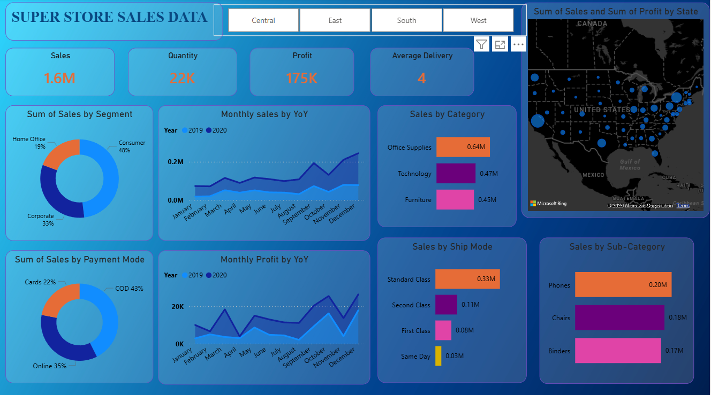
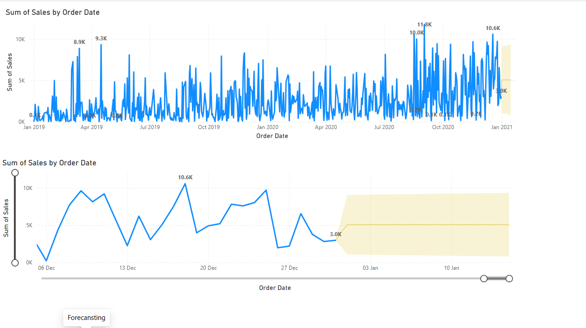

\# Super Store Sales Analysis \& Forecasting


\## Project Overview

This project focuses on analyzing Super Store sales data and forecasting future sales trends using Power BI and Python.


The dashboard helps in understanding:

\- Sales performance

\- Profit trends

\- Customer purchasing behavior

\- Regional performance

\- Future sales forecasting


\---


\# Project Objectives


\- Analyze overall sales and profit performance

\- Identify top-performing categories and sub-categories

\- Understand customer payment preferences

\- Analyze shipping methods used by customers

\- Track monthly sales and profit trends

\- Forecast future sales using time series analysis

\- Create an interactive dashboard for business decision-making


\---

## Sales Dashboard


## Sales Forecasting



\# Key Business Insights


\## 1. Overall Sales Performance

\- Total Sales reached around \*\*1.6M\*\*

\- Total Quantity Sold was around \*\*22K\*\*

\- Total Profit generated was around \*\*175K\*\*


\---


\## 2. Customer Segment Analysis

\- Consumer segment contributed the highest sales

\- Corporate segment showed moderate contribution

\- Home Office segment contributed the least sales


\### Insight

Consumer customers are the primary revenue source for the business.


\---


\## 3. Category-wise Sales Analysis

\- Office Supplies generated the highest sales

\- Technology category performed consistently well

\- Furniture category generated comparatively lower sales


\### Insight

Office Supplies products are driving maximum revenue.


\---


\## 4. Sub-Category Analysis

Top-performing sub-categories:

\- Phones

\- Chairs

\- Binders


\### Insight

These products have strong customer demand and can be focused on for future growth.


\---


\## 5. Payment Mode Analysis

Most used payment methods:

\- COD

\- Online Payments

\- Cards


\### Insight

Customers prefer Cash on Delivery over other payment methods.


\---


\## 6. Shipping Mode Analysis

\- Standard Class shipping was used the most

\- Same Day delivery had the lowest usage


\### Insight

Customers mostly prefer cost-effective shipping methods over faster delivery.


\---


\## 7. Monthly Sales \& Profit Trends

\- Sales and profit increased significantly towards the end of the year

\- Seasonal growth observed during festive and holiday periods


\### Insight

Business experiences strong year-end sales growth.


\---


\## 8. Regional Analysis

\- Different states showed varying sales and profit levels

\- Some states generated high sales but lower profit margins


\### Insight

Regional optimization strategies can improve profitability.


\---


\# Sales Forecasting Analysis


The forecasting section predicts future sales trends using historical sales data.


\---


\## Forecasting Objectives

\- Predict future sales performance

\- Identify future sales patterns

\- Support business planning and inventory management


\---


\## Forecasting Process


\### Data Cleaning

\- Removed missing values

\- Converted date columns into datetime format

\- Aggregated daily sales data


\### Time Series Analysis

\- Checked stationarity of data

\- Applied differencing techniques

\- Performed trend analysis


\### Forecasting Model

\- Used ARIMA model for forecasting

\- Generated future sales predictions


\---


\# Forecasting Insights


\- Sales trend shows future growth potential

\- Forecast indicates stable sales movement

\- Seasonal fluctuations are visible in sales data


\### Business Benefit

Forecasting helps businesses:

\- Manage inventory

\- Improve planning

\- Reduce stock shortages

\- Make better business decisions


\---


\# Problems Solved in This Project


\- Analyzed large sales dataset efficiently

\- Converted raw data into meaningful insights

\- Identified business growth opportunities

\- Predicted future sales trends

\- Built interactive visual dashboards


\---


\# Technologies Used


\## Dashboard \& Visualization

\- Power BI


\## Programming \& Analysis

\- Python

\- Pandas

\- NumPy

\- Matplotlib

\- Statsmodels


\## Development Tools

\- Jupyter Notebook

\- Excel

\- CSV


\---


\# Project Folder Structure


```text

SuperStore-Sales-Analysis/

│

├── Dashboard/

├── Dataset/

├── Forecasting/

├── Images/

└── README.md

```


\---


\# Files Included


\## Dashboard Folder

\- Power BI Dashboard (.pbix)


\## Dataset Folder

\- Excel Dataset

\- CSV Dataset


\## Forecasting Folder

\- Jupyter Notebook

\- HTML Report

\- PDF Report


\## Images Folder

\- Dashboard Screenshot

\- Forecasting Screenshot


\---


\# Future Improvements / To-Do List


\- Add advanced forecasting models

\- Deploy dashboard online

\- Add customer segmentation analysis

\- Create real-time dashboard integration

\- Improve forecasting accuracy

\- Add KPI comparison metrics


\---


\# Conclusion


This project demonstrates how Power BI and Python can be used together for business analytics and sales forecasting.


The dashboard provides meaningful business insights, while forecasting helps in predicting future sales trends for better business decision-making.


\---


\# Author


Naman Rajvanshi

